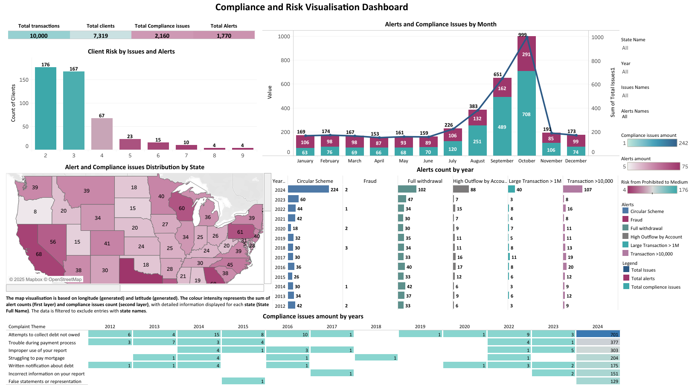

# Financial Risk Monitoring Pipeline

An end-to-end portfolio case study combining **Python data preparation, complaint-theme analysis, PostgreSQL transaction-monitoring rules and Tableau visualisation**.

The project consolidates two linked analytical exercises into one coherent workflow:

`public/sample data → preparation → complaint clustering → relational model → SQL monitoring scenarios → dashboard-ready data → Tableau`



## Interactive dashboard

**Tableau Public:**  
https://public.tableau.com/views/ComplianceandRiskDashboard-2025/ComplianceandRiskVisualizationDashboardstory

The packaged Tableau workbook is also available in `dashboard/compliance_risk_dashboard.twbx`.

## Project objective

The project explores how structured transaction data and unstructured/semi-structured complaint data can be combined to support financial-risk monitoring and stakeholder reporting.

It demonstrates:

- integration of account, transaction and complaint data;
- text preparation and complaint-theme consolidation;
- relational data modelling in PostgreSQL;
- rule-based monitoring scenarios;
- client-level risk aggregation;
- time and geographic analysis;
- stakeholder-focused Tableau reporting.

## Data

The portfolio uses public/sample datasets:

- **IBM AMLSim example dataset** — account and transaction data;
- **Banking consumer complaint analysis dataset** — issue/sub-issue records used for complaint analysis.

Repository snapshots contain:

| Dataset | Records |
|---|---:|
| Accounts | 7,319 |
| Transactions | 10,000 |
| Complaints | 2,160 |
| Tableau alert observations | 1,770 |

No employer, client or confidential data are used.

## Monitoring scenarios

The core dashboard uses six scenario categories:

| Code | Scenario | Logic |
|---|---|---|
| SCENARIO_501 | Transaction >10,000 | Flags transactions above 10,000 |
| SCENARIO_502 | High Outflow by Account | Flags transactions from senders whose total outflow exceeds 50,000 |
| SCENARIO_503 | Circular Scheme | Detects two-way A→B / B→A transaction patterns |
| SCENARIO_504 | Fraud | Uses the fraud indicator provided in the sample transaction data |
| SCENARIO_505 | Large Transaction >1M | Flags transactions above 1,000,000 |
| SCENARIO_506 | Full withdrawal | Flags transactions equal to the sender's initial balance |

An additional rounded-amount rule from the SQL coursework is retained in `sql/05_optional_scenario_507.sql` but was not used in the final Tableau story.

### Alert-count interpretation

The dashboard reports **1,770 alert observations**. These are event-level rows rather than unique investigations. For circular patterns, the Tableau preparation represents both legs of each directed match. This distinction is documented deliberately to avoid interpreting the count as 1,770 unique cases.

## Complaint analysis

The complaint workflow starts from `Issue` and `Sub-issue`, then uses text processing and precomputed clustering output to consolidate the records into seven business-friendly themes:

- False statements or representation
- Struggling to pay mortgage
- Improper use of your report
- Attempts to collect debt not owed
- Trouble during payment process
- Incorrect information on your report
- Written notification about debt

The cleaned notebook uses the stored clustering result so the repository can be opened without downloading a large sentence-embedding model.

## Data model

The relational layer links:

`accounts → transactions → alerts`

and

`accounts → complaints`

The original ERD is included in `docs/original_erd.png`. The cleaned schema in `sql/01_schema.sql` refines several implementation details and data types.

## Repository structure

```text
financial-risk-monitoring-pipeline/
├── README.md
├── requirements.txt
├── .gitignore
├── data/
│   ├── README.md
│   ├── raw/
│   │   ├── accounts.csv
│   │   ├── transactions.csv
│   │   └── complaints.json
│   └── processed/
│       ├── complaints_clustered.csv
│       ├── transaction_scenarios.csv
│       ├── client_risk.csv
│       ├── state_risk_summary.csv
│       └── dashboard_kpis.csv
├── notebooks/
│   └── financial_risk_monitoring_pipeline.ipynb
├── scripts/
│   └── build_dashboard_inputs.py
├── sql/
│   ├── 01_schema.sql
│   ├── 02_load_data.sql
│   ├── 03_monitoring_scenarios.sql
│   ├── 04_dashboard_views.sql
│   └── 05_optional_scenario_507.sql
├── dashboard/
│   ├── README.md
│   ├── compliance_risk_dashboard.twbx
│   └── dashboard_overview.png
└── docs/
    ├── data_model.md
    ├── original_erd.png
    └── refactoring_notes.md
```

## How to use

### Python

```bash
pip install -r requirements.txt
python scripts/build_dashboard_inputs.py
```

Or open:

```text
notebooks/financial_risk_monitoring_pipeline.ipynb
```

### PostgreSQL

From the repository root:

```bash
psql -d your_database -f sql/01_schema.sql
psql -d your_database -f sql/02_load_data.sql
psql -d your_database -f sql/03_monitoring_scenarios.sql
psql -d your_database -f sql/04_dashboard_views.sql
```

The six core scenario rules reproduce the alert categories used for the Tableau story.

## Tableau design

The visualisation project was designed around stakeholder requirements including:

- a high-level compliance/risk snapshot;
- risk categorisation;
- month/year trend analysis;
- regional hotspot identification;
- scenario-level alert breakdown;
- long-term complaint-theme monitoring.

The final story uses KPI tiles, bar charts, a geographic map, a monthly combined trend and a highlight table. The original project also evaluated alternative chart types before selecting the final views.

## Portfolio refactor

The source work contained development history, MongoDB credentials placeholders, experimental transformations and academic-report formatting. The portfolio version removes those elements and documents substantive corrections in `docs/refactoring_notes.md`.

One important change is that the public processing **does not randomly assign missing states**. Unsupported geography remains missing.

## Technologies

- Python
- Pandas / NumPy
- text clustering workflow
- PostgreSQL / SQL
- MongoDB (original integration layer)
- Tableau
- Jupyter Notebook

## Portfolio context

This repository is a portfolio reconstruction using public/sample data. It demonstrates analytical workflow design and does not represent a production AML monitoring system or automatic decision-making tool.
